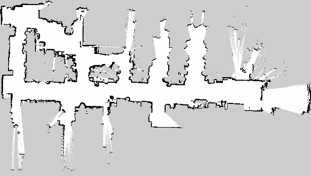

# second_project — LiDAR mapping and autonomous navigation

ROS 2 package that builds a 2D occupancy map from a recorded LiDAR run, then drives
a simulated omnidirectional robot through a sequence of goals inside that map,
localising with AMCL and avoiding obstacles with Nav2.

Coursework for *Robotics* — MSc Automation and Control Engineering, Politecnico di
Milano.



## The two tasks

**Task 1 — Mapping.** A rosbag provides a 3D LiDAR point cloud, noisy odometry and
the TF tree of an AgileX UGV. SLAM Toolbox consumes 2D scans, not point clouds, so
the data has to be reduced first; the output is the occupancy grid shown above.

**Task 2 — Navigation.** The map from Task 1 becomes the world of a Stage
simulation. Nav2 localises the robot in it and drives it through waypoints read from
a CSV, one at a time.

## Pipeline

```
/ugv/rslidar_points ──▶ pointcloud_to_laserscan ──▶ /scan_raw
                                                       │
                                                 scan_qos_relay
                                                       │
                                                    /scan ──▶ slam_toolbox ──▶ map
```

Two conversion steps deserve an explanation, because neither is obvious:

**Point cloud to laser scan.** The 3D cloud is flattened into a planar scan by
keeping returns between −0.4 m and 1.0 m relative to the LiDAR frame. The lower
bound discards ground returns, which would otherwise be mapped as a wall
everywhere; the upper bound discards overhangs the robot can safely drive under.

**QoS bridge.** LiDAR drivers publish with *best effort* reliability, which is the
right choice for a sensor stream: a dropped scan is better than a stalled pipeline.
SLAM Toolbox subscribes as *reliable*. In ROS 2 those two profiles are incompatible
and the subscription silently never matches — no error, no data, just an empty map.
`scan_qos_relay` is a minimal node that republishes the scan under a reliable
profile, which is what makes the two ends connect.

The same relay is reused in Task 2 to bridge Stage's `base_scan` output to Nav2.

## Requirements

- ROS 2 Humble
- `slam_toolbox`, `nav2_bringup` and the Nav2 servers listed in `package.xml`
- `pointcloud_to_laserscan`
- `stage_ros2` (`stage_ros2_stageros`)
- The course rosbag, which is not distributed here

## Build

```bash
source /opt/ros/humble/setup.bash
colcon build --packages-select second_project
source install/setup.bash
```

## Task 1 — build the map

```bash
ros2 launch second_project mapping.launch.py
```

Then replay the bag in a second terminal:

```bash
ros2 bag play --clock <path/to/rosbag>
```

| Argument       | Default | Purpose                                     |
| -------------- | ------- | ------------------------------------------- |
| `slam_mode`    | `async` | `async` or `sync` SLAM Toolbox node         |
| `use_sim_time` | `true`  | Follow `/clock` from bag playback           |
| `rviz`         | `true`  | Start RViz with the mapping configuration   |

When the run is complete, save the result:

```bash
ros2 run nav2_map_server map_saver_cli -f map/map
```

The `map/` folder already contains a reconstructed map (`map.png` + `map.yaml`) plus
the SLAM Toolbox serialised graph (`map.data`, `map.posegraph`), so Task 2 can be
run without repeating Task 1.

## Task 2 — navigate the map

```bash
ros2 launch second_project navigation.launch.py
```

One command brings up Stage with the reconstructed map, the full Nav2 stack, the
goal publisher and RViz.

| Argument            | Default | Purpose                                        |
| ------------------- | ------- | ---------------------------------------------- |
| `stage_gui`         | `false` | Show the Stage window as well as RViz          |
| `use_goal_publisher`| `true`  | Set to `false` to send goals manually in RViz  |
| `rviz`              | `true`  | Start RViz with the navigation configuration   |
| `autostart`         | `true`  | Auto-configure the Nav2 lifecycle nodes        |

The goal publisher starts 12 s after the stack, giving AMCL and the lifecycle
managers time to reach the active state before the first goal arrives.

### Waypoints

`csv/goals.csv`, one pose per line:

```csv
x,y,theta
1.6,-4.4,-0.013
12.3,-4.0,1.513
```

Goals are sent through the `navigate_to_pose` **action**, not as bare topic
messages. The action gives a per-goal result, which is what lets the node advance
the queue only once the robot has actually arrived — and keep going instead of
stalling when Nav2 reports `ABORTED` for an unreachable pose.

Point it at a different file without rebuilding:

```bash
ros2 run second_project goal_publisher --ros-args -p csv_path:=/path/to/goals.csv
```

All goals are also published as a `PoseArray` on `/goals` and the active one on
`/current_goal`, both latched, so RViz shows the full plan from the moment it
connects.

## Layout

```
src/goal_publisher.cpp   reads the CSV, drives the navigate_to_pose action client
src/scan_qos_relay.cpp   best-effort → reliable LaserScan bridge
launch/mapping.launch.py      Task 1: conversion + SLAM Toolbox + RViz
launch/navigation.launch.py   Task 2: Stage + Nav2 + goal publisher + RViz
config/                  SLAM Toolbox params, Nav2 params, two RViz configurations
map/                     reconstructed map and serialised SLAM graph
worlds/                  Stage world wrapping the reconstructed map
csv/goals.csv            waypoint sequence
```

## Notes

- The robot is modelled on the **AgileX Scout Mini** with omnidirectional
  kinematics; the Stage world sets the footprint accordingly.
- The Stage floorplan size must match the saved map
  (`width_px × resolution`). The header of `worlds/second_project.world`
  documents the conversion — a mismatch here shifts the whole simulated
  environment relative to the map used for localisation.
- `map.posegraph` is ~27 MB. It is only needed to resume mapping in SLAM Toolbox;
  navigation needs just `map.png` and `map.yaml`.

## License

MIT — see [LICENSE](LICENSE).
